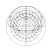
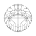

# Astrolabe Projection Drawers

Generate horizon projection SVGs with `pixi`.

## Setup

This project uses `pixi` to manage Python and the project environment. The `pixi.toml` in this repository currently targets `win-64`, so the setup below is intended for Windows.

1. Clone this repository and enter the project directory.

   In PowerShell, run:

   ```powershell
   git clone https://github.com/Schuai/Astrolabe-Projection-Drawers.git
   cd programs
   ```

2. Install `pixi`.

   In PowerShell, run:

   ```powershell
   powershell -ExecutionPolicy Bypass -c "irm -useb https://pixi.sh/install.ps1 | iex"
   ```

   Then restart your terminal so the updated `PATH` takes effect.

3. Create the project environment.

   In this repository folder, run:

   ```powershell
   pixi install
   ```

   This reads `pixi.toml`, installs the required Python version, and creates the local project environment.

4. Run commands through `pixi`.

   You can run the scripts without manually activating anything:

   ```powershell
   pixi run draw-azimuthal-equidistant -- --help
   pixi run draw-stereographic -- --help
   ```

   `pixi run` will use the environment defined by this project. If the environment has not been installed yet, `pixi run` can install it automatically.

5. Optional: open a shell inside the project environment.

   ```powershell
   pixi shell
   ```

6. Run the interactive image rectifier.

   ```powershell
   pixi run perspective-correct -- --input-path "E:\path\to\input.png" --save-path "E:\path\to\output.png"
   ```

Official pixi docs:

- Installation: https://pixi.prefix.dev/latest/installation/
- `pixi install`: https://pixi.prefix.dev/latest/reference/cli/pixi/install/

## Azimuthal Equidistant

Use `draw_azimuthal_equidistant.py` through the `draw-azimuthal-equidistant` task:

```powershell
pixi run draw-azimuthal-equidistant -- @(
  "--latitude", "35",
  "--center", "north",
  "--range-latitude", "-55",
  "--diameter", "40",
  "--azimuth-lines", "12",
  "--altitude-lines", "5",
  "--boundary-width", "0.1",
  "--horizon-width", "0.2",
  "--azimuth-width", "0.1",
  "--altitude-width", "0.1",
  "--civil-twilight",
  "--nautical-twilight",
  "--astronomical-twilight",
  "--twilight-width", "0.15",
  "--twilight-style", "dashed",
  "--equator-tropics",
  "--equator-tropics-width", "0.12",
  "--day-unequal-hour-lines",
  "--night-unequal-hour-lines",
  "--day-unequal-hour-labels",
  "--night-unequal-hour-labels",
  "--unequal-hour-label-style", "arabic",
  "--unequal-hour-width", "0.1",
  "--unequal-hour-label-size", "0.8",
  "--unequal-hour-label-width", "0.15",
  "--unequal-hour-label-line-position", "0.5",
  "--unequal-hour-label-arc-adjust", "0.0",
  "--solar-motion-direction", "clockwise",
  "--unequal-hour-label-letter-spacing", "0.6",
  "--azimuth-labels",
  "--azimuth-label-size", "0.8",
  "--azimuth-label-width", "0.15",
  "--azimuth-label-position", "0.35",
  "--azimuth-label-center-adjust", "0.0",
  "--azimuth-label-letter-spacing", "0.6",
  "--crosshair",
  "--crosshair-horizontal-width", "0.1",
  "--crosshair-vertical-width", "0.15",
  "--output", "examples/azimuthal_equidistant.svg"
)
```



## Notes

- `--range-latitude -55` means `55S`.
- `--diameter` is in millimeters.
- The exported SVG adds an automatic outer margin so thick strokes and labels are not clipped.
- The sky region appears above the image by default, for both north-centered and south-centered output.
- Use `--rotate-180` to rotate the projection 180 degrees and place the sky region below the image.
- `--boundary-width` sets the outer boundary line width in millimeters.
- `--horizon-width` sets the horizon line width in millimeters.
- `--azimuth-width` sets the azimuth line width in millimeters.
- `--altitude-width` sets the altitude line width in millimeters.
- `--civil-twilight` draws the `-6 degree` twilight line.
- `--nautical-twilight` draws the `-12 degree` twilight line.
- `--astronomical-twilight` draws the `-18 degree` twilight line.
- `--twilight-width` sets the shared twilight line width in millimeters.
- `--twilight-style` sets twilight lines to `solid` or `dashed`.
- `--astronomical-twilight-width` is kept as a legacy fallback when `--twilight-width` is not set.
- `--equator-tropics` draws the celestial equator and the northern/southern tropic lines.
- `--equator-tropics-width` sets the shared line width for those three lines in millimeters.
- The tropic declination is fixed at `23.4392911111` degrees.
- `--day-unequal-hour-lines` draws the 11 daytime unequal-hour lines, dividing sunrise to sunset into 12 equal temporal hours.
- `--night-unequal-hour-lines` draws the 11 nighttime unequal-hour lines, dividing sunset to sunrise into 12 equal temporal hours.
- `--unequal-hour-width` sets the shared line width for both daytime and nighttime unequal-hour lines in millimeters.
- `--day-unequal-hour-labels` labels the daytime unequal-hour lines.
- `--night-unequal-hour-labels` labels the nighttime unequal-hour lines.
- Unequal-hour labels are drawn only when their corresponding unequal-hour lines are also enabled.
- `--unequal-hour-label-style` switches unequal-hour labels between `roman` and `arabic`.
- `--unequal-hour-label-size` sets the unequal-hour label font size in millimeters.
- `--unequal-hour-label-width` sets the unequal-hour label stroke width in millimeters.
- `--unequal-hour-label-line-position` sets where the label sits along each unequal-hour line from the outer visible tropic-side anchor: `0` is closest to that outer anchor, `1` is farther inward, and negative values extend outward along the line trend.
- `--unequal-hour-label-arc-adjust` shifts the label along its label circle within `[-1, 1]`: positive moves toward larger hour numbers, negative toward smaller ones, scaled by the arc to the adjacent hour-line point on the same circle.
- `--solar-motion-direction` sets whether solar motion, unequal-hour label numbering, and azimuth label handedness increase `clockwise` or `counterclockwise`.
- `--unequal-hour-label-letter-spacing` sets the spacing between unequal-hour label glyphs in millimeters.
- Unequal-hour labels stay upright instead of rotating with the line, and are placed as close as practical to the outer visible tropic side while staying inside the current projection range.
- Unequal-hour lines are traced across the Sun's declination range between the two tropics, so at latitudes with circumpolar day or night they may appear only over part of that range.
- `--azimuth-labels` adds `N, NE, E, SE, S, SW, W, NW` between the horizon and the astronomical twilight line.
- `--azimuth-label-size` sets the label font size in millimeters.
- `--azimuth-label-width` sets the label stroke width in millimeters.
- `--azimuth-label-position` sets where the label sits between horizon and astronomical twilight: `0` is on the horizon, `1` is on the astronomical twilight line.
- `--azimuth-label-center-adjust` nudges labels along the local tangent in millimeters. Use positive or negative values if they look visually left- or right-shifted.
- `--azimuth-label-letter-spacing` sets the spacing between glyphs in millimeters.
- Azimuth labels are drawn with built-in vector sans-serif glyphs, so they do not depend on installed fonts.
- `--crosshair` draws horizontal and vertical center lines across the whole projection.
- `--crosshair-width` sets the fallback line width for both crosshair lines in millimeters when neither axis-specific width is set.
- `--crosshair-horizontal-width` sets the horizontal crosshair line width in millimeters.
- `--crosshair-vertical-width` sets the vertical crosshair line width in millimeters.
- If only one axis-specific crosshair width is set, the other axis defaults to `0` and is not drawn.

## Stereographic

Use `draw_stereographic.py` through the `draw-stereographic` task. It accepts the same arguments as the azimuthal-equidistant drawer:

```powershell
pixi run draw-stereographic -- @(
  "--latitude", "50",
  "--center", "south",
  "--range-latitude", "23.5",
  "--diameter", "40",
  "--azimuth-lines", "12",
  "--altitude-lines", "5",
  "--boundary-width", "0.1",
  "--horizon-width", "0.2",
  "--azimuth-width", "0.1",
  "--altitude-width", "0.1",
  "--civil-twilight",
  "--nautical-twilight",
  "--astronomical-twilight",
  "--twilight-width", "0.15",
  "--twilight-style", "dashed",
  "--equator-tropics",
  "--equator-tropics-width", "0.12",
  "--day-unequal-hour-lines",
  "--night-unequal-hour-lines",
  "--day-unequal-hour-labels",
  "--night-unequal-hour-labels",
  "--unequal-hour-label-style", "arabic",
  "--unequal-hour-width", "0.1",
  "--unequal-hour-label-size", "0.8",
  "--unequal-hour-label-width", "0.15",
  "--unequal-hour-label-line-position", "0.1",
  "--unequal-hour-label-arc-adjust", "0.2",
  "--solar-motion-direction", "counterclockwise",
  "--unequal-hour-label-letter-spacing", "0.6",
  "--azimuth-labels",
  "--azimuth-label-size", "0.8",
  "--azimuth-label-width", "0.15",
  "--azimuth-label-position", "0.35",
  "--azimuth-label-center-adjust", "0.0",
  "--azimuth-label-letter-spacing", "0.6",
  "--crosshair",
  "--crosshair-horizontal-width", "0.1",
  "--crosshair-vertical-width", "0.15",
  "--output", "examples/stereographic.svg"
)
```



- `draw_stereographic.py` keeps the same CLI as `draw_azimuthal_equidistant.py`.
- In stereographic projection, the antipodal pole diverges to infinity, so `--range-latitude` cannot be the opposite pole itself.

## Image Rectifier

Use `perspective_corrector.py` through the `perspective-correct` task:

```powershell
pixi run perspective-correct -- --input-path "E:\path\to\input.png" --save-path "E:\path\to\output.png"
```

The script opens an interactive OpenCV window for manual rectification.

### Mode Selection

- Press `b` to use quadrilateral mode.
- Press `c` to select circle mode.

### Quadrilateral Mode

- Press `a` to arm the next point.
- Left click once to place that point.
- Press `d` to delete the most recently added point.
- Add 4 points in order around the target region.
- Starting from the second point, each new point is connected to the previous point.
- After the fourth point, the preview closes the shape back to the first point.
- Press `Enter` to rectify the selected quadrilateral into a square.

### Result Preview

- Press `s` to save the corrected image to `--save-path` and exit.
- Press `q` to exit without saving.
- Press `r` to discard the current result and restart from the original image.
- Press `a` to start a new selection on top of the corrected image.

### Circle Mode Status

- `c` mode is currently not implemented.
- Three points on a circle are not enough to recover a reliable perspective rectification uniquely.
- If circle-based rectification is needed later, the workflow should use more points and ellipse fitting or additional geometric constraints.
