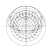

# Astrolabe Projection Drawers

Generate horizon projection SVGs with `pixi`.

## Setup

This project uses `pixi` to manage Python and the project environment. The `pixi.toml` in this repository currently targets `win-64`, so the setup below is intended for Windows.

1. Clone this repository and enter the project directory.

   In PowerShell, run:

   ```powershell
   git clone https://github.com/Schuai/Astrolabe-Projection-Drawers.git
   cd programs
   ```

2. Install `pixi`.

   In PowerShell, run:

   ```powershell
   powershell -ExecutionPolicy Bypass -c "irm -useb https://pixi.sh/install.ps1 | iex"
   ```

   Then restart your terminal so the updated `PATH` takes effect.

3. Create the project environment.

   In this repository folder, run:

   ```powershell
   pixi install
   ```

   This reads `pixi.toml`, installs the required Python version, and creates the local project environment.

4. Run commands through `pixi`.

   You can run the scripts without manually activating anything:

   ```powershell
   pixi run draw-azimuthal-equidistant -- --help
   pixi run draw-stereographic -- --help
   ```

   `pixi run` will use the environment defined by this project. If the environment has not been installed yet, `pixi run` can install it automatically.

5. Optional: open a shell inside the project environment.

   ```powershell
   pixi shell
   ```

6. Run the interactive image rectifier.

   ```powershell
   pixi run perspective-correct -- --input-path "E:\path\to\input.png" --save-path "E:\path\to\output.png"
   ```

Official pixi docs:

- Installation: https://pixi.prefix.dev/latest/installation/
- `pixi install`: https://pixi.prefix.dev/latest/reference/cli/pixi/install/

## Desktop GUI

Start the integrated desktop application with:

```powershell
pixi run gui
```

The first two tabs expose the azimuthal-equidistant and stereographic drawing
tasks. Basic arguments remain visible; dependent controls appear only when their
parent feature is enabled. Hover over an argument name for its description, then
press **Update Preview** to render without overwriting a file. When ecliptic
output is enabled, the main and companion drawings have separate preview tabs.

The perspective-correction tab loads an image directly into the application.
Click four corners in order, then update the preview to rectify the quadrilateral
to a square. Points can be undone or reset before correction.

Use **File > Import Configuration** to open a README/text/PowerShell file or to
paste a `pixi run` command, a PowerShell `@(...)` argument list, or plain CLI
arguments. Imported text is parsed but never executed. **Save** and **Save As**
export SVG, transparent PNG, or white-background JPEG; raster projection output
uses the DPI selected under **Settings > Raster Export DPI** (300 by default).
Ecliptic output is saved beside the main image with an
`_ecliptic` suffix.

Use **File > Export Configuration** to save the active drawing tab to a `.txt`
file containing a README-compatible PowerShell `pixi run ... -- @(...)`
command. Only currently effective arguments are written, and the exported file
can be imported again.

The interface starts in English. Use **Settings > Language** to switch the
entire application between English and Chinese; the selection takes effect
immediately and is remembered for the next launch.

## Azimuthal Equidistant

Use `draw_azimuthal_equidistant.py` through the `draw-azimuthal-equidistant` task:

```powershell
pixi run draw-azimuthal-equidistant -- @(
  "--latitude", "35",
  "--center", "north",
  "--range-latitude", "-55",
  "--diameter", "40",
  "--azimuth-lines", "30",
  "--altitude-lines", "15",
  "--sub-azimuth-lines", "3",
  "--sub-altitude-lines", "3",
  "--boundary-width", "0.1",
  "--horizon-width", "0.2",
  "--azimuth-width", "0.1",
  "--altitude-width", "0.1",
  "--sub-azimuth-width", "0.05",
  "--sub-altitude-width", "0.05",
  "--civil-twilight",
  "--nautical-twilight",
  "--astronomical-twilight",
  "--twilight-width", "0.15",
  "--twilight-style", "dashed",
  "--equator-tropics",
  "--equator-tropics-width", "0.12",
  "--day-unequal-hour-lines",
  "--night-unequal-hour-lines",
  "--day-unequal-hour-labels",
  "--night-unequal-hour-labels",
  "--unequal-hour-label-style", "arabic",
  "--unequal-hour-width", "0.1",
  "--unequal-hour-label-size", "0.8",
  "--unequal-hour-label-width", "0.15",
  "--unequal-hour-label-line-position", "0.5",
  "--unequal-hour-label-arc-adjust", "0.0",
  "--solar-motion-direction", "clockwise",
  "--unequal-hour-label-letter-spacing", "0.6",
  "--azimuth-labels",
  "--azimuth-label-size", "0.8",
  "--azimuth-label-width", "0.15",
  "--azimuth-label-position", "0.35",
  "--azimuth-label-center-adjust", "0.0",
  "--azimuth-label-letter-spacing", "0.6",
  "--crosshair",
  "--crosshair-horizontal-width", "0.1",
  "--crosshair-vertical-width", "0.15",
  "--output", "examples/azimuthal_equidistant.svg"
)
```



## Notes

- `--range-latitude -55` means `55S`.
- `--diameter` is in millimeters.
- The exported SVG adds an automatic outer margin so thick strokes and labels are not clipped.
- The sky region appears above the image by default, for both north-centered and south-centered output.
- Use `--rotate-180` to rotate the projection 180 degrees and place the sky region below the image.
- `--boundary-width` sets the outer boundary line width in millimeters.
- `--horizon-width` sets the horizon line width in millimeters.
- `--azimuth-lines` draws azimuth lines every N degrees; use `0` to disable them.
- `--altitude-lines` draws altitude lines every N degrees; use `0` to disable them.
- `--sub-azimuth-lines` splits each azimuth main interval into `N` cells using sub-lines. `0` or `1` disables them.
- `--sub-altitude-lines` splits each altitude main interval into `N` cells using sub-lines. `0` or `1` disables them.
- `--azimuth-width` sets the azimuth line width in millimeters.
- `--altitude-width` sets the altitude line width in millimeters.
- `--sub-azimuth-width` sets the sub-azimuth line width in millimeters.
- `--sub-altitude-width` sets the sub-altitude line width in millimeters.
- `--civil-twilight` draws the `-6 degree` twilight line.
- `--nautical-twilight` draws the `-12 degree` twilight line.
- `--astronomical-twilight` draws the `-18 degree` twilight line.
- `--twilight-width` sets the shared twilight line width in millimeters.
- `--twilight-style` sets twilight lines to `solid` or `dashed`.
- `--astronomical-twilight-width` is kept as a legacy fallback when `--twilight-width` is not set.
- `--equator-tropics` draws the celestial equator and the northern/southern tropic lines.
- `--equator-tropics-width` sets the shared line width for those three lines in millimeters.
- The tropic declination is fixed at `23.4392911111` degrees.
- `--day-unequal-hour-lines` draws the 11 daytime unequal-hour lines, dividing sunrise to sunset into 12 equal temporal hours.
- `--night-unequal-hour-lines` draws the 11 nighttime unequal-hour lines, dividing sunset to sunrise into 12 equal temporal hours.
- `--unequal-hour-width` sets the shared line width for both daytime and nighttime unequal-hour lines in millimeters.
- `--day-unequal-hour-labels` labels the daytime unequal-hour lines.
- `--night-unequal-hour-labels` labels the nighttime unequal-hour lines.
- Unequal-hour labels are drawn only when their corresponding unequal-hour lines are also enabled.
- `--unequal-hour-label-style` switches unequal-hour labels between `roman` and `arabic`.
- `--unequal-hour-label-size` sets the unequal-hour label font size in millimeters.
- `--unequal-hour-label-width` sets the unequal-hour label stroke width in millimeters.
- `--unequal-hour-label-line-position` sets where the label sits along each unequal-hour line from the outer visible tropic-side anchor: `0` is closest to that outer anchor, `1` is farther inward, and negative values extend outward along the line trend.
- `--unequal-hour-label-arc-adjust` shifts the label along its label circle within `[-1, 1]`: positive moves toward larger hour numbers, negative toward smaller ones, scaled by the arc to the adjacent hour-line point on the same circle.
- `--solar-motion-direction` sets whether solar motion, unequal-hour label numbering, and azimuth label handedness increase `clockwise` or `counterclockwise`.
- `--unequal-hour-label-letter-spacing` sets the spacing between unequal-hour label glyphs in millimeters.
- Unequal-hour labels stay upright instead of rotating with the line, and are placed as close as practical to the outer visible tropic side while staying inside the current projection range.
- Unequal-hour lines are traced across the Sun's declination range between the two tropics, so at latitudes with circumpolar day or night they may appear only over part of that range.
- `--azimuth-labels` adds `N, NE, E, SE, S, SW, W, NW` between the horizon and the astronomical twilight line.
- `--azimuth-label-size` sets the label font size in millimeters.
- `--azimuth-label-width` sets the label stroke width in millimeters.
- `--azimuth-label-position` sets where the label sits between horizon and astronomical twilight: `0` is on the horizon, `1` is on the astronomical twilight line.
- `--azimuth-label-center-adjust` nudges labels along the local tangent in millimeters. Use positive or negative values if they look visually left- or right-shifted.
- `--azimuth-label-letter-spacing` sets the spacing between glyphs in millimeters.
- Azimuth labels are drawn with built-in vector sans-serif glyphs, so they do not depend on installed fonts.
- `--crosshair` draws horizontal and vertical center lines across the whole projection.
- `--crosshair-width` sets the fallback line width for both crosshair lines in millimeters when neither axis-specific width is set.
- `--crosshair-horizontal-width` sets the horizontal crosshair line width in millimeters.
- `--crosshair-vertical-width` sets the vertical crosshair line width in millimeters.
- If only one axis-specific crosshair width is set, the other axis defaults to `0` and is not drawn.

## Stereographic

Use `draw_stereographic.py` through the `draw-stereographic` task. It accepts the same arguments as the azimuthal-equidistant drawer:

```powershell
pixi run draw-stereographic -- @(
  "--latitude", "50",
  "--center", "south",
  "--range-latitude", "23.5",
  "--diameter", "40",
  "--azimuth-lines", "30",
  "--altitude-lines", "15",
  "--sub-azimuth-lines", "3",
  "--sub-altitude-lines", "3",
  "--boundary-width", "0.1",
  "--horizon-width", "0.2",
  "--azimuth-width", "0.1",
  "--altitude-width", "0.1",
  "--sub-azimuth-width", "0.05",
  "--sub-altitude-width", "0.05",
  "--civil-twilight",
  "--nautical-twilight",
  "--astronomical-twilight",
  "--twilight-width", "0.15",
  "--twilight-style", "dashed",
  "--equator-tropics",
  "--equator-tropics-width", "0.12",
  "--day-unequal-hour-lines",
  "--night-unequal-hour-lines",
  "--day-unequal-hour-labels",
  "--night-unequal-hour-labels",
  "--unequal-hour-label-style", "arabic",
  "--unequal-hour-width", "0.1",
  "--unequal-hour-label-size", "0.8",
  "--unequal-hour-label-width", "0.15",
  "--unequal-hour-label-line-position", "0.1",
  "--unequal-hour-label-arc-adjust", "0.2",
  "--solar-motion-direction", "counterclockwise",
  "--unequal-hour-label-letter-spacing", "0.6",
  "--azimuth-labels",
  "--azimuth-label-size", "0.8",
  "--azimuth-label-width", "0.15",
  "--azimuth-label-position", "0.35",
  "--azimuth-label-center-adjust", "0.0",
  "--azimuth-label-letter-spacing", "0.6",
  "--crosshair",
  "--crosshair-horizontal-width", "0.1",
  "--crosshair-vertical-width", "0.15",
  "--output", "examples/stereographic.svg"
)
```


- `draw_stereographic.py` keeps the same CLI as `draw_azimuthal_equidistant.py`.
- In stereographic projection, the antipodal pole diverges to infinity, so `--range-latitude` cannot be the opposite pole itself.

## Ecliptic

Use `--ecliptic` to write the ecliptic as a separate companion SVG for the same projection, and `--ecliptic-width` to control its line width in millimeters.

- `--ecliptic-band-width` sets the band width in millimeters between the ecliptic and its inner concentric curve. If omitted, it defaults to the ecliptic circle radius.
- `--ecliptic-angle-lines` draws main inward ecliptic angle tick marks every `N` degrees along the ecliptic.
- `--sub-ecliptic-angle-lines` splits each main ecliptic angle interval into `N` cells using sub tick marks. `0` or `1` disables them.
- `--ecliptic-angle-width` sets the main ecliptic angle tick mark width in millimeters.
- `--sub-ecliptic-angle-width` sets the sub ecliptic angle tick mark width in millimeters.
- `--ecliptic-rotation-direction` sets whether ecliptic longitudes and date-ring dates increase `clockwise` or `counterclockwise` in the companion ecliptic SVG. If omitted, it follows `--solar-motion-direction`.
- Main tick marks and sub tick marks both span the full ecliptic band width.
- The companion ecliptic SVG draws both the outer ecliptic and its inner concentric curve, keeps the projection boundary circle for alignment, and emits ecliptic ticks from the traditional stereographic source point where the equinox and solstice chords intersect.
- `--date-ring` draws a date ring outside the projection counter in the companion ecliptic SVG.
- The date ring is concentric with the projection counter center, not with the ecliptic circle center.
- The projection counter itself is the date ring inner boundary.
- `--date-ring-width` sets the stroke width of the date ring inner and outer boundaries. If omitted, it follows `--ecliptic-width`.
- `--date-ring-band-width` sets the radial width in millimeters between the counter and the date ring outer boundary, independent of the ecliptic geometry.
- `--rotate-date-ring-180` rotates the entire date ring by `180` degrees. It is off by default.
- `--date-ring-month-width` sets the stroke width of month-end date ring ticks.
- `--date-ring-sub-width` sets the stroke width of sub day date ring ticks.
- `--date-ring-sub-interval` sets the day spacing of sub ticks. `1` means daily ticks. `0` disables them.
- `--date-ring-sub-sub-width` sets the stroke width of second-level sub day date ring ticks.
- `--date-ring-sub-sub-interval` sets the day spacing of second-level sub ticks. `1` means daily ticks. `0` disables them.
- `--date-ring-month-labels` labels the starts of months on the date ring with upright Arabic month numbers, aligned to the corresponding previous month-end boundary.
- `--date-ring-month-label-size` sets the month label font size in millimeters.
- `--date-ring-month-label-width` sets the month label stroke width in millimeters.
- `--date-ring-month-label-line-position` sets where the month label sits across the date-ring band from the outer boundary: `0` is outermost, `1` is closest to the counter, and negative values extend outward.
- `--date-ring-month-label-arc-adjust` shifts the month label along the date ring by a fixed angle in degrees: positive moves toward later dates in the month, negative toward earlier dates.
- `--date-ring-month-label-letter-spacing` sets the spacing between month label glyphs in millimeters.
- Date ring month labels are radially oriented by default with their tops pointing toward the center. `--reverse-date-ring-month-label-orientation` flips them so their bottoms point toward the center instead.
- `--date-ring-year` chooses which calendar year's solar-longitude progression is used to optimize the date-ring phase. The default is `2026`.
- The date ring always uses `365` equal day divisions. Leap years do not add a February 29 slot; the ring stays idealized and the selected year only changes the optimized phase and the reported error summary.
- Instead of forcing any specific calendar day to the vernal point, the program chooses the single phase offset that minimizes the maximum angular date-ring error across the selected year.
- That longitude approximation is a standard Julian-day solar-position formula of the Meeus/NOAA style: it computes Julian centuries from J2000, then solar mean longitude, mean anomaly, equation of center, true longitude, and a small apparent-longitude correction.
- This is intended for date-ring alignment and error estimation, not for high-precision ephemeris work.
- When `--date-ring` is enabled, the program prints a stdout summary of the equal-day ring error relative to approximate true solar ecliptic longitude progression for the selected year.

```powershell
pixi run draw-stereographic -- @(
  "--latitude", "50",
  "--center", "south",
  "--range-latitude", "23.5",
  "--diameter", "40",
  "--azimuth-lines", "0",
  "--altitude-lines", "0",
  "--ecliptic",
  "--ecliptic-width", "0.17",
  "--ecliptic-band-width", "2.0",
  "--ecliptic-angle-lines", "30",
  "--sub-ecliptic-angle-lines", "3",
  "--ecliptic-angle-width", "0.11",
  "--sub-ecliptic-angle-width", "0.05",
  "--ecliptic-rotation-direction", "counterclockwise",
  "--date-ring",
  "--date-ring-width", "0.17",
  "--date-ring-band-width", "2.0",
  "--date-ring-month-width", "0.11",
  "--date-ring-sub-width", "0.05",
  "--date-ring-sub-sub-width", "0.03",
  "--date-ring-sub-interval", "1",
  "--date-ring-sub-sub-interval", "5",
  "--date-ring-month-labels",
  "--date-ring-month-label-size", "0.8",
  "--date-ring-month-label-width", "0.15",
  "--date-ring-month-label-line-position", "0.5",
  "--date-ring-month-label-arc-adjust", "0.0",
  "--date-ring-month-label-letter-spacing", "0.6",
  "--date-ring-year", "2026",
  "--output", "examples/stereographic.svg"
)
```

This produces:

- `examples/stereographic.svg`
- `examples/stereographic_ecliptic.svg`

The companion ecliptic file uses the main `--output` filename with an added `_ecliptic` suffix before `.svg`.

## Image Rectifier

Use `perspective_corrector.py` through the `perspective-correct` task:

```powershell
pixi run perspective-correct -- --input-path "E:\path\to\input.png" --save-path "E:\path\to\output.png"
```

The script opens an interactive OpenCV window for manual rectification.

### Mode Selection

- Press `b` to use quadrilateral mode.
- Press `c` to select circle mode.

### Quadrilateral Mode

- Press `a` to arm the next point.
- Left click once to place that point.
- Press `d` to delete the most recently added point.
- Add 4 points in order around the target region.
- Starting from the second point, each new point is connected to the previous point.
- After the fourth point, the preview closes the shape back to the first point.
- Press `Enter` to rectify the selected quadrilateral into a square.

### Result Preview

- Press `s` to save the corrected image to `--save-path` and exit.
- Press `q` to exit without saving.
- Press `r` to discard the current result and restart from the original image.
- Press `a` to start a new selection on top of the corrected image.

### Circle Mode Status

- `c` mode is currently not implemented.
- Three points on a circle are not enough to recover a reliable perspective rectification uniquely.
- If circle-based rectification is needed later, the workflow should use more points and ellipse fitting or additional geometric constraints.
